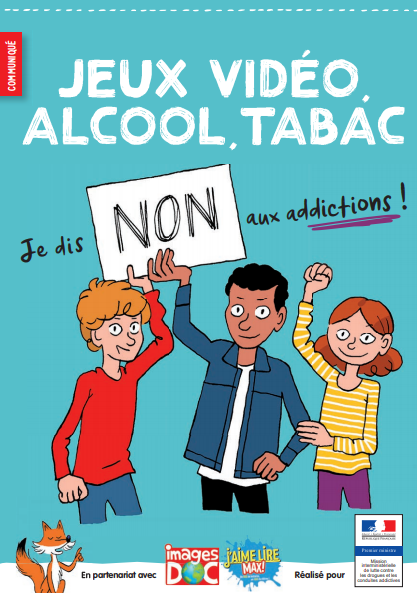


Video games are pretty fun aren't they? Yes of course they are... Until they become too big a part of your daily life and take away from the time you have to spend on other things.

Today we're going to talk about addiction in the world of video games which is a taboo subject that should not be ignored, and we'll draw a parallel with my experience.


## Sub 2010s

#### *SNES* Era

When I was a child, I used to play *Super Nintendo Entertainment System* with my father and my sister. As every child, I was always asking to play with them, but as every child, I was too young! Sometimes, I trusted that I was playing like a boss when my controller was unplugged :neutral_face:. Other times, I was playing with one of them and enjoying that a lot! It is a great memorie: these moments of playing video games at this time were quite rare due to my age.

#### *GameCube* Era

Christmas 2002, we were celebrating it at my place. My parents handed me a gift package. I hasten to unwrap it out of impatience and...: "A *GameCube* Controller? Don't they know that I haven't a *GameCube*?". Obviously they gave me the console just after, they are not that sadistic! <u>That's when my life as a young boy took a turn</u>.

When I had just had it, I knew how to regulate myself, at least my parents did. Then time passed a little bit, I started to play it more and more, to think about it a lot etc. In primary school, it was one of my favorite topics of discussion with my friends. Up to the moment I started to fall into excess. I know "excess" is a strong term but for me it was: Do you know someone that was into video games to wake up 2 hours before his alarm in the middle of the week, when he was 7 years old? Personally I know him rather well. Do you?

This was the time when my parents started to hide my controllers, giving me a playing time limit not to be exceeded, and a bunch of restrictions to reduce my video game obsession. When I was coming back from school, the first thing I did wasn't my homework, but throwing my bag and diving onto the console. But at this time, that was pretty ok because they were behind me trying to regulate me as much as possible.

#### *Wii* Era

Christmas 2006, four year after *THE* Christmas. We were celebrating it at my grandparents place. My sister and I just received the brand new *Nintendo* console: the *Wii*. My parents really insisted that the console be shared between us because they knew very well about my relationship with video games. It was a really special moment. I really didn't expect to have it considering my behavior with video games in general. I was really hysterical! It had to be said that at the time, it was marketed as the console for everyone. The geeky kid was no longer the target, what was promoted to sell it was to move at the same time, to let off steam with *Wii Sports*!

As one could expect, and as my parents hoped wouldn't happen: everything was the same. I lived for the Wii, breathed Wii, slept Wii, talked Wii. It was truly an obsession.

The problem was that I was about to enter middle school. With middle school came the beginning of independence for a child - we didn't finish school at the same time as our parents, so we were home earlier, and so on. You see where I'm going with this: No one was there to restrict me in real time. When my stuff wasn't hidden, I would come home from school and do nothing but play until one of my parents came home. When my stuff was hidden, I put all my energy into finding the controllers, and eventually did the same thing sooner or later. To put it simply, I put off my homework to the maximum, it wasn't my priority at all.

In addition, I was heavily involved in the competitive *Mario Kart Wii* scene. I had a team, participated in tournaments against other teams, and tried to get time trial world rankings. It really didn't help me detach from it, quite the opposite.

## Post 2010s

#### PC Era

In the last year of middle school, after annoying my parents for months and months, I managed to get a PC under the condition of getting good grades. The deal seemed really fair to me.

One thing I didn't mention earlier is that my grades had dropped compared to my first year in middle school. Losing 7 points on a scale of 20 in 4 years, that is something... I understand my parents, what do you think when you've tried everything? Especially since I didn't have any difficulty, I was doing <u>ABSOLUTELY ANYTHING</u>. I always relied on my abilities.

At that time, I mainly played two games that occupied all my time (time that I didn't spend with my family and IRL friends). Let's start with the first one: *Minecraft*.
Looking back, it was really cool, even though I already played it on the family computer. It was a kind of alternative social life, I was on a server with lots of friends who were a bit like me. I knew these people much better than some people in my class, even though I had never seen them in real life. It was a very time-consuming game, but I really enjoyed it, especially during the holidays... It was also through this game that I started writing my first lines of code.

The second game I played was *League of Legends*. I started playing it when it was released, and I still play it sometimes. The game itself is quite enjoyable, but everything else around it is not. At first, I played it very calmly with my friends and the atmosphere was cool. However, I discovered the "Ranked" matches, which are ranked games based on elo (like chess, a points system indicating the player's level). This is what makes the game's system highly addictive and puts most players on edge. Being competitive, nobody wants to lose in order to increase their elo and not see it drop. We almost forget that it's just a game, our ego is at stake. Many people have fallen into this loop, myself included.

One thing that I find quite shocking is that player behavior is studied by psychologists in order to keep the player in a state where they want to start another game. Matchmaking is designed so that each player has a probability of winning/losing based on the ideal situation that will make them play one more game. It's very vicious.

This led me to repeat my first year of high school. After this event, I woke up a little so that it wouldn't happen again, but I still played, although a little less. A fracture had really been created at that time: I was the nightmare of some teachers and they were my nightmare (fortunately, the university gave me a much better image of the teaching staff, it's a profession that I respect a lot, at least in higher education from my experience).

## Post High School
I don't really have much to say for this section except that I learned to moderate myself and take a step back from the situation. This is probably due to the fact that I was really interested in what I was studying in my graduate studies, and therefore I was taken a little more seriously. A nice revenge on my school life is that I received the <u>highest honors</u> for my License's degree (License which I loved) even though I continued to play, at a lower level, during that time.

## Conclusion

To me it is quite clear that video games do not develop addiction in themselves (maybe a behavioral addiction?). When I see that the French state has paid a communication campaign to warn parents that video games are ultra addictive and dangerous, placing them on the same pedestal as cigarettes or alcohol, which are physical addictions to psychoactive substances... I don't even have the words to explain my discontent.

I really think that we need to work on mentalities regarding this "addiction" in order to better manage situations of abuse. By "abuse" I mean excessive use by the user who would play too much, like the abuse of industries that profit from the most receptive profiles to keep perpetual attention, which is not healthy (see *League of Legends*).

We can be too much into something, according to different criteria. We can more easily become addicted to sugar than to video games, with much more risks to our health, yet the subject receives less attention. Overusing video games is not a good thing, just like sugar. My situation is enough to testify to this, we need to know how to moderate our consumption, like everything else.

Finally, I think we need to look further than video games themselves for potential problems. What can push someone to play so much? Escaping reality? There are many young people who use video games as a means of escape. To change their ideas, nothing better than immersing themselves in another world? Avoiding Depression? I think everyone has their reasons and we should not always see it in a negative light.

- A song echoes the last part of this conclusion to me:


- And another one which is a classic for my French readers (Did you know that this song is by *Madeon*?):
